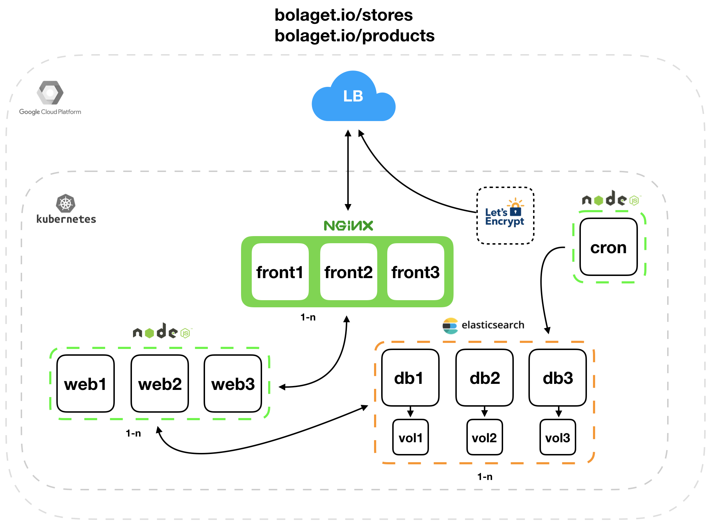

# bolaget.io (https://bolaget.io)

[](https://travis-ci.org/larsha/bolaget.io)

This API has nothing to do with Systembolaget, this app consumes a large XML API from Systembolaget and transforms it into a REST JSON API. More info can be found here: http://www.systembolaget.se/api

## **Flowchart**



## **Versions**

Please have a look at [`CHANGELOG.md`](CHANGELOG.md) for more information. Otherwise this project adheres to [Semantic Versioning](http://semver.org/spec/v2.0.0.html).

| Version |          Url          |
| ------- | :-------------------: |
| `v1`    | https://bolaget.io/v1 |

_All resources will be available without versioning in the url and be an alias for the latest API version._

## **Products**

```http
GET /products
Host: bolaget.io
```

- **URL Params**

  **_Optional:_**

  `limit=[number]` - Default limit is 10, max limit is 100

  `offset=[number]`

  `ecological=[bool]`

  `koscher=[bool]`

  `ethical=[bool]`

  `year_from=[number]`

  `year_to=[number]`

  `sales_start_from=[date]` - YYYY-MM-DD

  `sales_start_to=[date]` - YYYY-MM-DD

  `price_from=[number]`

  `price_to=[integer]`

  `volume_from=[integer]`

  `volume_to=[number]`

  `assortment=[alphanumeric]` - BS = Reservation assortment, TSE = Temporary assortment, FS = Regular assortment and FSN = Regular assortment (new product)

  `assortment_text=[alphanumeric]` - Ordervaror = BS, Fast sortiment = FS, Tillfälligt sortiment = TSE, Fast sortiment = FS/FSE

  `sort=[alphanumeric]` - Property to sort by, accepting:

  - `price:asc|desc`
  - `price_per_liter:asc|desc`
  - `volume_in_milliliter:asc|desc`
  - `sales_start:asc|desc`
  - `year:asc|desc`
  - `zip_code:asc|desc`
  - `name:asc|desc`<br><br>

  `name|type|style|provider|producer|origin|origin_country|packaging|product_group|sealing|commodities=[alphanumeric]` - Fuzzy match

  `search=[alphanumeric]` - Fuzzy search in several fields

* **Response headers:**

  `X-Total-Count=[number]` - Total count of products based on filtering used for pagination

- **Success Response:**

  - **Code:** 200 <br />
    **Content:** `[{ name: '117 Grythyttan' ... }]` or `[]`

* **Error Response:**

  - **Code:** 500 INTERNAL SERVER ERROR <br />
    **Content:** `{ error : "Ouch, an ugly error has occured!" }`

## **Product**

```http
GET /products/:nr
GET /products/:article_nr
Host: bolaget.io
```

- **Success Response:**

  - **Code:** 200 <br />
    **Content:** `{ nr: 12, name: "117 Grythyttan" ... }`

* **Error Response:**

  - **Code:** 500 INTERNAL SERVER ERROR <br />
    **Content:** `{ error : "Ouch, an ugly error has occured!" }`

  OR

  - **Code:** 404 NOT FOUND <br />
    **Content:** `{ error : "Move along, nothing to see here!" }`

## **Stores**

```http
GET /stores
Host: bolaget.io
```

- **URL Params**

  **_Optional:_**

  `limit=[number]` - Default limit is 10, max limit is 100

  `offset=[number]`

  `labels=[alphanumeric]` - Takes a comma separated list, eg. norrbotten,jämtland, returns documents containing all labels matched (fuzzy)

  `sort=[alphanumeric]` - Property to sort by, accepting:

  - `RT90x:asc|desc`
  - `RT90y:asc|desc`
  - `address:asc|desc`
  - `city:asc|desc`
  - `county:asc|desc`<br><br>

  `type|name|city|county|address=[alphanumeric]` - Fuzzy match

  `search=[alphanumeric]` - Fuzzy search in several fields

* **Response headers:**

  `X-Total-Count=[number]` - Total count of stores based on filtering used for pagination

- **Success Response:**

  - **Code:** 200 <br />
    **Content:** `[{ adress_1: 'Kungsholmstorg 11 A' ... }]` or `[]`

* **Error Response:**

  - **Code:** 500 Internal Server Error <br />
    **Content:** `{ error : "Ouch, an ugly error has occured!" }`

## **Store**

```http
GET /stores/:nr
Host: bolaget.io
```

- **Success Response:**

  - **Code:** 200 <br />
    **Content:** `{ address: "Vasagatan 25", ... }`

* **Error Response:**

  - **Code:** 500 INTERNAL SERVER ERROR <br />
    **Content:** `{ error : "Ouch, an ugly error has occured!" }`

  OR

  - **Code:** 404 NOT FOUND <br />
    **Content:** `{ error : "Move along, nothing to see here!" }`

## **Development environment**

#### Kubernetes

You need a local Kubernetes cluster (minikube, docker-for-mac etc.) with `helm` installed.

Build:

```bash
make build
```

Install:

```bash
helm install \
  -f chart/values.yaml \
  -f chart/values-dev.yaml \
  --set web.image.tag=local \
  --set web.image.pullPolicy=Never \
  --name bolagetio \
  ./chart
```

#### Docker Compose

Using Docker and Docker Compose (https://www.docker.com/)

**Build**

- `docker-compose build`

**Start**

- `docker-compose up web`

**Start worker**

- `docker-compose run --rm web npm run dev:worker`

**Run tests**

- `docker-compose run --rm web npm test`
